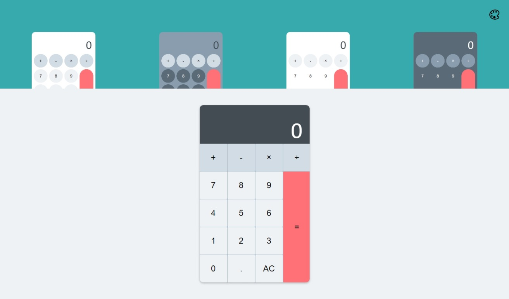

# Calculator Project with themes

Hello everyone, this repository contains a finished solution for a basic Calculator, check out the live version
[here](https://calculator-with-themes.demanderbag.vercel.app/).

This project is created using: HTML / CSS / JavaScript

- **User story:** User can select one of four themes
- **User story:** User can see this page on the mobile
- **User story:** User can calculate two numbers
- **User story:** User can press equals key multiple times and get the result as long as at least one number and one operation was pressed before

**Practice:** In this project, I've used CSS Grid, JavaScript arrow functions as well as data-sets and event listeners

